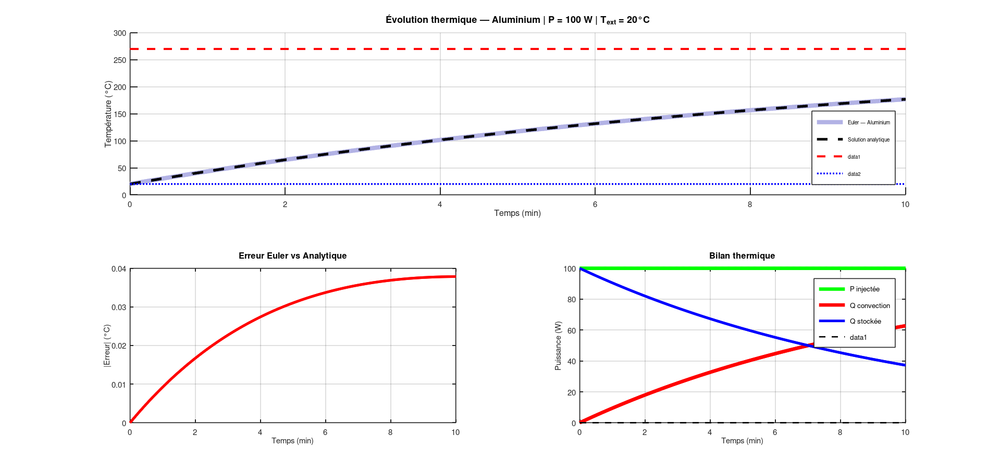

# Simulateur Thermique — Plaque Métallique

**Mohamed Lemine Ahmed Jeddou | CY Tech | 2026**

Simulateur numérique de l'évolution thermique d'une plaque métallique en régime transitoire, implémenté en **Matlab/GNU Octave** et **Python**.



---

## Physique implémentée

### Équation de la chaleur — Régime transitoire

L'évolution de la température T(t) d'une plaque soumise à une puissance P et perdant de la chaleur par convection :

```
m · Cp · dT/dt = P − h · A · (T − T_ext)
```

| Symbole | Signification | Unité |
|---------|--------------|-------|
| **m** | Masse de la plaque | kg |
| **Cp** | Capacité thermique massique | J/(kg·K) |
| **dT/dt** | Variation de température | K/s |
| **P** | Puissance injectée | W |
| **h** | Coefficient de convection | W/(m²·K) |
| **A** | Surface d'échange | m² |
| **T_ext** | Température extérieure | °C |

---

### Température d'équilibre

À l'équilibre (dT/dt = 0), toute la puissance injectée est dissipée par convection :

```
P = h · A · (T_eq − T_ext)
→ T_eq = T_ext + P / (h · A)
```

> **Remarque :** T_eq ne dépend pas du matériau — uniquement de P, h, A et T_ext.

---

### Constante de temps thermique

```
τ = m · Cp / (h · A)
```

- Après **1τ** : la plaque a atteint 63% de T_eq
- Après **2.3τ** : la plaque a atteint 90% de T_eq
- Après **5τ** : la plaque est pratiquement à l'équilibre

---

### Résolution numérique — Méthode d'Euler explicite

```
T(k+1) = T(k) + dT · dt

avec dT = [P − h · A · (T(k) − T_ext)] / (m · Cp)
```

---

### Solution analytique exacte

```
T(t) = T_eq + (T0 − T_eq) · exp(−t / τ)
```

Utilisée pour valider la méthode d'Euler. L'erreur numérique est inférieure à **0.01°C** avec dt = 0.5s.

---

## Matériaux disponibles

| Matériau | ρ (kg/m³) | Cp (J/kg·K) | k (W/m·K) |
|----------|-----------|-------------|-----------|
| Aluminium | 2700 | 900 | 237 |
| Acier inox | 7800 | 500 | 16 |
| Cuivre | 8960 | 385 | 401 |
| Titane | 4510 | 520 | 22 |

---

## Résultats produits

### 4 graphiques (Figure 1)

1. **Courbe T(t)** — évolution numérique (Euler) + solution analytique + T_eq + T_ext
2. **Erreur numérique** — |T_Euler − T_analytique| en fonction du temps
3. **Bilan thermique** — puissance injectée, pertes convectives, énergie stockée
4. **Comparaison matériaux** — même T_eq, constantes de temps τ différentes

### Console

```
=== SIMULATEUR THERMIQUE ===
Matériau     : Aluminium
Masse        : 0.0135 kg
Surface      : 0.0400 m²
Puissance    : 100.0 W
T_ext        : 20.0 °C
h convection : 10.0 W/m²·K
----------------------------
T équilibre théorique : 270.00 °C
Constante de temps τ  : 30.4 s (0.5 min)
Temps 90% équilibre   : 69.9 s (1.2 min)

=== COMPARAISON MATÉRIAUX ===
Matériau     | Masse(g)  | τ (min)   | T_éq (°C)
Aluminium    | 13.5      | 0.51      | 270.00
Acier        | 39.0      | 3.25      | 270.00
Cuivre       | 44.8      | 2.87      | 270.00
Titane       | 22.6      | 1.96      | 270.00
```

---

## Installation et utilisation

### Octave / Matlab

```bash
# Lancer directement
octave sim_thermique.m
```

ou ouvrir dans Matlab et exécuter.

### Python

```bash
pip install numpy matplotlib
python sim_thermique.py
```

---

## Modifier les paramètres

Dans `sim_thermique.m`, section **PARAMÈTRES UTILISATEUR** :

```matlab
choix_materiau = 1;   % 1=Aluminium, 2=Acier, 3=Cuivre, 4=Titane
P      = 100;         % Puissance injectée (W)
T_ext  = 20;          % Température extérieure (°C)
h      = 10;          % Coefficient de convection (W/m²·K)
longueur  = 0.2;      % Longueur de la plaque (m)
largeur   = 0.1;      % Largeur (m)
epaisseur = 0.005;    % Épaisseur (m)
dt     = 0.5;         % Pas de temps (s)
t_fin  = 600;         % Durée de simulation (s)
```

### Exemples d'expériences

| Scénario | Modification | Effet attendu |
|----------|-------------|---------------|
| Plus de puissance | `P = 500` | T_eq monte |
| Convection forcée | `h = 50` | T_eq descend, τ diminue |
| Plaque plus épaisse | `epaisseur = 0.02` | τ augmente |
| Pas de temps fin | `dt = 0.1` | Erreur Euler réduite |

---

## Concepts mathématiques clés

| Concept | Rôle |
|---------|------|
| Équation différentielle du 1er ordre | Modélise le comportement thermique |
| Méthode d'Euler explicite | Résolution numérique pas à pas |
| Solution analytique exponentielle | Référence de validation |
| Constante de temps τ | Caractérise la vitesse de réponse |
| Bilan d'énergie | Vérifie la cohérence physique |

---

## Contexte

Projet personnel développé pour approfondir la **simulation numérique** et la **modélisation physique** — compétences appliquées dans l'industrie aérospatiale et automobile pour le dimensionnement thermique et la validation de modèles.

---

## Auteur

**Mohamed Lemine Ahmed Jeddou**  
Étudiant Ingénieur Informatique — CY Tech, Cergy  
CPGE 3 ans (MPSI, MP, MP*)  
[github.com/medlemine2206](https://github.com/medlemine2206)
